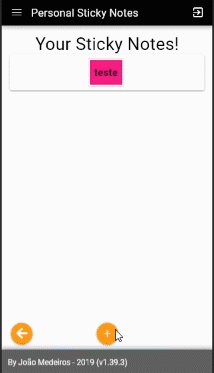
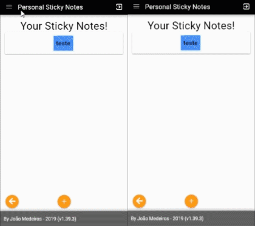

# Personal Sticky Notes

## CRUD


## Settings Color



##### EN
  This is a simple "TODO" demonstrating the Firebase Firestore technology with Quasar "Vuejs".

##### PT-BR
	Bloco de anotações pessoal para demonstrativo das tecnologias Firestore e Vuejs
- [x] Firebase / Firestore
- [x] Login
- [x] Register / with a database profile
- [x] Forgot Password
- [x] Change Password
- [x] Quasar / Vue
- [x] CRUD
- [x] Realtime Firestore Methods (Socket's)
- [x] A Simple Sticky Notes
- [x] Permission "Admin and Normal" on Profiles

### How to Settings Firebase

##### Copy ".env.example" to .env, change .env file to put the firebase keys
```bash
APIKEY=apiKey
AUTHDOMAIN=apiKey.firebaseapp.com
DATABASEURL=https://apiKey.firebaseio.com
PROJECTID=apiKey
STORAGEBUCKET=apiKey.appspot.com
MESSAGINGSENDERID=apiKey
APPID=1:apiKey
```


#### O Modelo - The Model
```
{
  "app": [
    {
      "uid": "userUid",
      "textColor": "#00ff33",
      "backgroundColor": "#55ff66",
      "stickyNotes": [
        {
          "idStickyNotes": "idStickyNotes",
          "content": "content here",
          "createdAt": "timestamp here"
        }
      ]
    }
  ],
  "users": [
    {
      "uid": "userUid",
      "name": "user name",
      "email": "email@exemple.com",
      "permission": "normal | admin"
    }
  ]
}
```
### How to Install / Como instalar
	yarn -i | npm install

### How to run / Como executar
	yarn quasar dev | or | quasar dev

### How to build / Como criar build
##### For build SPA / Para uma build de SPA
	yarn quasar build | or | quasar build

##### For PWA build / Para uma build PWA
	yarn quasar build -m pwa | or | quasar build -m pwa
